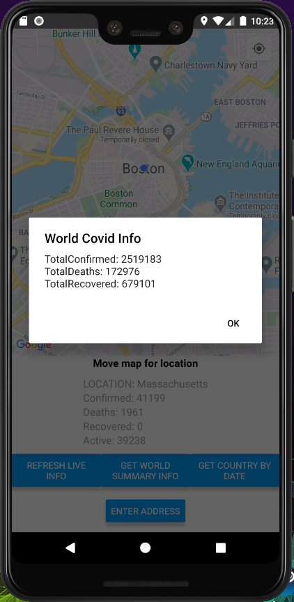

# codvid-app-djtrinh
codvid-app-djtrinh created by GitHub Classroom

# Introduction
In this homework, we will be creating a react native application to query and plot Covid 19 information is real-time.

## Steps 1 and 2
We the first two steps require setting up the react native development environment. This involves installing Android Studio, Node.js and other
dependencies.

The following command is to initialize the example project

```python
npx react-native init AwesomeProject
```

After creating the example project directory, we go ahead and run the next two commands to run the reactive native project.

```python
cd AwesomeProject
npx react-native start
```


```python
cd AwesomeProject
npx react-native run-android
```


## Step 3

The following command is to install the maps apit

```python
npm install react-native-maps --save-exact
```
App.js was modified to show a map. Google API keys were also generated and pushed into the AndroidManifest.xml file.

We can then run the application the same way again.
```python
cd maps
npx react-native start
```

```python
cd maps
npx react-native run-android
```


## Step 4 and 5

In the final steps, we will be integrating the COVID19 restful API at https://covid19api.com/. 
The package dependencies that have to be installed are with the following commands:

```python
npm install --save react-native-maps
npm i react-native-dialog-input
npm install @react-native-community/geolocation --save
npm i react-native-popup-dialog
npm install react-native-datepicker --save
```

Next, we need to place our Google Maps API keys into the following file at
maps\android\app\src\main\AndroidManifest.xml.

We will need to obtain keys from https://www.geocod.io/ because we are converting from latitude and longitude to
city, state, and country (geocoding). You would place your key in App.js. Search and replace "&api_key=" with
with "&api_key=your_key".

After all the keys and packages are setup, you can begin running the application.
In the maps project run the following command:

```python
npx react-native run-android
```

You will be greeted with the following UI:


The "REFRESH LIVE INFO" updates the COVID info you are in view of.
You can also move the map to achieve the same result. 
Scrolling down, you get a live update of the country's COVID info as well.


Clicking the "GET WORLD SUMMARY INFO" provides a pop-up dialog of the current
COVID statistics for the entire world.



Clicking the "GET COUNTRY BY DATE" provides a pop-up dialog of the current
COVID statistics for the current country by date. The following is an example
of the US COVID statistics on 02-04-2020.


Clicking on "ENTER ADDRESS" allows the user to jump to a specific location
on the map by zip code or full address.


